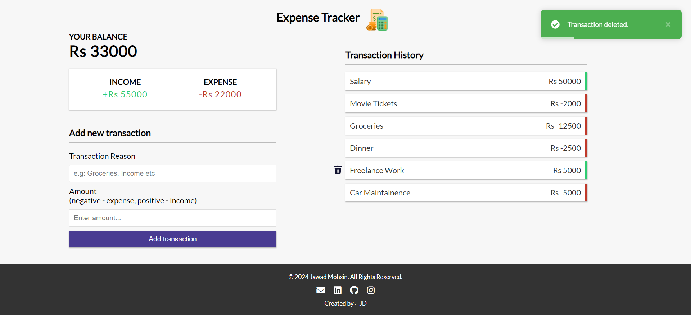

# Vue Expense Tracker

A simple expense tracker web application built with Vue.js.

## User Interface



## Features

- View total balance
- View income and expenses
- Add new transactions
- Delete existing transactions

## Installation

1. Clone the repository:

    ```bash
    git clone https://github.com/jawad-mohsin/expense-tracker.git
    ```

2. Navigate to the project directory:

    ```bash
    cd expense-tracker
    ```

3. Install dependencies:

    ```bash
    npm install
    ```

## Usage

1. Run the development server:

    ```bash
    npm run start
    ```

2. Open your browser and go to [http://localhost:8080](http://localhost:8080)


## Technologies Used

- Vue.js
- Vue Router
- LocalStorage (for data persistence)

## Contributing

Contributions are welcome! Please feel free to submit a pull request.

<h3 align="center">- Thank You! 😊🚀 </h3>  


